# Posture Flex

[View published site on GitHub Pages](https://meldissa.github.io/p1-posture-flex/)

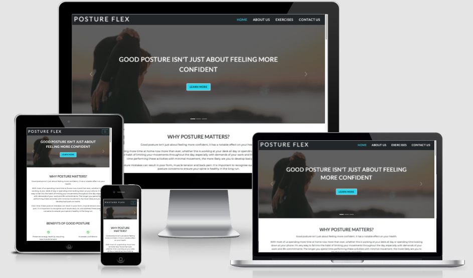

Image from [Am I Responsive](http://ami.responsivedesign.is/).

## Project Overview

Posture Flex is a site that aims to provide information about posture and exercises to improve it. This site has been created as part of my Portfolio Project 1 for Code Institute.

## Table of Contents

1. [User Experience (UX)](#ux)
    * [Strategy](#strategy)
        * [Project Goals](#project-goals)
        * [User Stories](#user-stories)
    * [Scope](#scope)
    * [Design](#design)
        * [Colors](#colors)
        * [Typography](#typography)
        * [Imagery](#imagery)
    * [Skeleton](#skeleton)
        * [Wireframes](#wireframes)
2. [Features](#features)
    * [Current Features](#current-features)
    * [Future Features](#future-features)
3. [Technologies Used](#tech-used)
4. [Testing](#testing)
    * [User Stories Testing](#user-testing)
    * [Validation Testing](#validation-testing)
5. [Deployment](#deployment)
6. [Credits](#credits)
7. [Acknowledgements](#acknowledgements)

## User Experience (UX) 

## Strategy 

### Project Goals 

The main business goal for Posture Flex is to teach about benefits of good posture, why posture is important and to provide various exercises a user can learn and implement to improve their posture daily. The site users are interested in learning about benefits of good posture and performing exercises to help improve it. 

The target audience for the site would include users who are office workers/remote workers constantly working at a desk, or spend their day using technology and sitting down restricting their movement. Such posture and back issues are a common problem for those whose work doesn’t allow for much movement during the day. Users who find the lack of mobility, exhibit poor form, and will find that over time this results in a poor posture and back pain, therefore the site aims to capture this target audience and provide easy and simple solutions via exercises to help alleviate this issue. In addition, the site is accessible to all fitness levels and tries to account for this by offering beginner friendly exercises to improve posture which a user of any fitness level can complete.

### User Stories 

* __First Time Visitor Goals:__

    * I want to learn more about the site, the purpose, and the ethos of the company.
    * I want to learn why posture is important, what are the benefits of good posture and what are common posture mistakes.
    * I want to find information on the exercises available to improve my posture and how I can perform these.
    * I want to navigate easily through the site and find the relevant information with ease.
    * I want to locate their social media accounts so I can receive updates and see their following and how well they are known and reliable.
    * I want to be able to contact the company with any additional questions I may have regarding the information presented.

* __Returning Visitor Goals:__

    * I want to continue to perform the exercises to improve my posture.
    * I want to be able to contact the company with any further questions and/or be able to provide feedback.

* __Site Owner Goals:__

    * I want users to be able to find the information and exercises to improve their posture in an accessible and simple way.
    * I want users to be able to contact us with any questions or feedback of improvement regarding the content of the site.
    * I want users to be able to locate us on social media and follow us to increase the following.

## Scope 

To achieve the strategy goals, I want to implement the following features:

* A navigation bar fixed at the top of the screen which will allow the user to easily navigate and find the relevant sections even when the user scrolls down the page.
* A Home section that will focus on providing the user with the relevant information on posture to incentivise the user to stay on the site and continue without overwhelming with unnecessary information.
* An About Us section that will focus on providing the user with the company’s ethos and objective, this will act as additional marketing and legitimise the site to gain the user’s trust.
* An Exercises to provide the user with a list of exercises that can be performed to improve their posture, each exercise having detailed steps both written and visual to allow the user to follow these with ease.
* A Contact Us section which will allow the user to contact the organisation with any queries as well as provide feedback.
* A fully responsive design that will work on different devices including desktop, tablets, and mobile devices, allowing users to access the site anytime and anywhere.

## Design 

### Colors 

The palette was created using the [Coolors Website](https://www.coolors.co).

[Original Posture Flex Color Palette](docs/images/posture-flex-color-palette.png).

The original color palette created using the Coolors website consisted of 5 colors, however for my final idea I only opted for 3 main colors to use for my website.

The colors used in hex form are white (#fff), dark grey (#202020), and blue (#52daf1). The white color was used as the main background for the website, the dark grey was used for the header and footer and the blue was used for links and buttons. I kept it minimal and simple, so this does not distract the user from the main content of the site or overwhelm them with excessive use of different colors.

### Typography 

The fonts were obtained from [Google Fonts](https://fonts.google.com/).

For my logo text and heading I have used Lato. Lato is a sans serif typeface family, it is easy to read, and the strong structure provides a good base for the logo text and headings to capture the user’s attention.

For the main text I have selected Montserrat which complements Lato used for my headings and logo. 

I have avoided using overly stylised fonts, which can be difficult to read for users, therefore ensuring the website is more accessible to users with visual impairments.

In the event the font fails to load, I have used sans-serif as a back-up font.

### Imagery 

Images are obtained from the [Freepik](https://www.freepik.com/) and [Unsplash](https://unsplash.com/) websites.

I have used imagery appropriate to the website’s content to entice the user and provide visual examples in conjunction with the text for the different exercises.

Please see further details in the __Credits__ section for the specific images used within the project.

## Skeleton 

### Wireframes 

Wireframes were created using [Balsamiq Wireframes](https://www.balsamiq.com/).

The wireframes have examples of desktop, tablet, and mobile phone displays.

* [Posture Flex Wireframe](docs/images/Wireframe.png)

Originally, I wanted to create a website with 4 pages including Home, About Us, Exercises and Contact Us. However, for my final submission of the project I opted for a single paged website which consists of all these 4 pages split up into sections which can be accessed via the user scrolling down the page or selecting the section from the navigation bar.

## Features 

### Current Features 

For this project I opted for a single page website, this is fully responsive and consists of a header, footer and 4 main sections; Home, About Us, Exercises and Contact Us.

__Header__:

In the header section I have included a fully responsive navigation which is accessible at different screen sizes. On larger screens for desktops, the navigation bar consists of the Posture Flex logo on the left-hand side. The navigation buttons for Home, About Us, Exercises and Contact Us are locate on the right-hand side. The user can hover over the logo and each of the navigation section buttons which has the hover CSS style applied to change color so user is aware that this can be selected. The logo can be clicked which will take user back to the top and each of the navigation buttons will take the user to the relevant section of the website. The navigation is also fixed, so when the user scrolls down the page, this is still accessible and the user does not need to scroll back up to the top to access this. There is also the Bootstrap scrollspy component implemented for the navigation so when the user scrolls down the page the relevant section is highlighted to indicate to the user which section they are currently viewing. At smaller screen sizes the navigation for each of the section is collapsed in a burger menu and can be accessed once the user selects the burger menu to display the drop down for each of the section which the user can select. The header section also includes the Bootstrap carousel layout which consists of 3 slides cycling through automatically, if the user does hover over the slide, then this stops from moving forward. The slides also include buttons so the user can cycle through this on their own and at the bottom it displays which slide is currently displayed out of 3 in the form of bars. The purpose of the carousel slider was to capture the user with the use of imagery and captions on each slider with a relevant link to take the user to the desired section. 

__Home__: 

The Home section consists of content which provides the user an introduction of why posture matters, then proceeds to list the benefits of good posture and common posture mistakes. For the latter two sections I have used the Font Awesome icons and applied CSS style to add color to display the benefits in green and mistakes in red. This provides the user with further visual guidance on what these sections represent. I have kept the content simple and minimal, so this does not overwhelm the user with too much information.

__About Us (Learn More About Us)__: 

The About Us section has the Bootstrap featurette template style applied with text on the left and an image on the right. The text is brief and provides the user with information about Posture Flex and the company's goal. Once again this is kept simple to not overwhelm the user with information overload. The image used fits in with the general color scheme of the website and adds visual for the user to break up the section, so this is not just covered with text.

__Exercises (Try These Exercises)__: 

The Exercises section contains a list of 5 exercises the user can perform to improve their posture. Each exercise type is split up using a heading to indicate to the user that this is the start of a new section. This is followed by an image to represent what the exercise would look like, the duration of the exercise and the instructions on how to complete this which has an ordered list applied. For lager screens, the text is displayed on the right of the image so the user can view this side by side, and for smaller screens the text is displayed underneath the image so the user can scroll down to view this information without having to zoom in on the text or image. The duration and instruction sub-headings also have a Font Awesome icon applied to provide further visual display to the user.

__Contact Us (Get In Touch With Us)__: 

The Contact Us section is the last section the user can access once having scrolled down the webpage, once the user has fully viewed the information, they are then able to fill out a contact form. The contact form has a basic layout and gives the user the option to either provide feedback or submit a question via the dropdown option. The form is kept simple and easy to fill out, so this does not disinterest the user from submitting feedback or questions by having additional barriers such as excessive amount of required fields and information from user to be able to submit the form. Once the form is submitted this will open in a new tab to indicate to the user this has been submitted successfully, and the user is able to get back to the main site by switching between the tabs. This adds to the overall UX as the user is not taken away from the main site once form is submitted.

__Footer__: 

The Footer section allows the user to access the social media links, these links are displayed using the Font Awesome icons. The user is also able to hover over the links which have the CSS hover style applied to signal to the user which link they are selecting and opening. I have also added code to open the links in a new tab so the user is not taken away from the main website and can easily return, which would also improve the overall UX.

### Future Features 

Due to time constraints, I was unable to apply additional features, in the future I would like to implement the following:

* A sign up to newsletter option, to allow the user to be able to get frequent updates.
* Improve upon the Exercises section, by separating the exercises by posture concern. The user will then be able to select the relevant posture concern that they have and follow the set exercises making this more specialised. Add video to each exercise to allow the user the option to view this on how to complete the exercise.
* Add a blog section where the site will post up to date news, suggestions, and tips in relation to posture.

## Technologies Used 

For this project the main languages used are __HTML5__ and __CSS3__.

I have also utilised the following frameworks, libraries, and tools:

* [Bootstrap v5.0.1](https://getbootstrap.com/): 
    * Bootstrap has been used for overall responsiveness of the website, and for the layout to include navigation, carousel, featurette, and forms within the relevant sections of the website.
* [GitPod](https://www.gitpod.io/): 
    * I used GitPod as the IDE for this project and Git has been used for Version Control.
* [GitHub](https://www.github.com/): 
    * GitHub has been used to create a repository to host the project and receive updated commits from GitPod.
* [Balsamiq](https://balsamiq.com/): 
    * I used Balsamiq to create the wireframe for the website for the basic structure and layout.
* [Coolors](https://coolors.co/): 
    * I used Coolors website to create the color palette for my project to use this as a reference.
* [Freepik](https://www.freepik.com/): 
    * Freepik has been used for copyright free images for this project.
* [Unsplash](https://unsplash.com/): 
    * Unsplash has been used for copyright free images for this project.
* [Google Fonts](https://getbootstrap.com/): 
    * I have used Google Fonts to import fonts for styling purposes for this project.
* [Font Awesome](https://fontawesome.com/): 
    * Font Awesome was used to apply icons in the Home, Exercises and Footer sections.
* [GIMP v2.10](https://www.gimp.org/): 
    * GIMP image manipulator program was used to re-size images for this project.
* [Online Image Compressor](https://imagecompressor.com/):
    * Online Image Compressor was used to compress the 3 header images used in the carousel slider to improve the performance of the website on mobile.
* [Chrome Dev Tools](https://developers.google.com/web/tools/chrome-devtools): 
    * Chrome Dev Tools was used to test the site, assist with debugging issues and run reports from Lighthouse.
* [W3C Markup Validation Service](https://validator.w3.org/): 
    * The W3C Markup Validation Service was used to validate the HTML document for this project and to identify any issues with the code.
* [W3C CSS Validation Service](https://jigsaw.w3.org/css-validator/): 
    * The W3C CSS Validation Service was used to validate the CSS document for this project and to identify any issues with the code.
* [Color Contrast Accessibility Validator](https://color.a11y.com/):
    * This was used to test the color contrast accessibility for this project.
* [WAVE Web Accessibility Evaluation Tool](https://wave.webaim.org/):
    * WAVE was used to test the accessibility for this project.
* [Am I Responsive](http://ami.responsivedesign.is/):
    * Am I Responsive was used to create the header image for the README file.

## Testing 

### User Stories Testing 

* As a __First Time Visitor__ I want to learn more about the site, the purpose, and the ethos of the company.
* As a __First Time Visitor__ I want to learn why posture is important, what are the benefits of good posture and what are common posture mistakes.

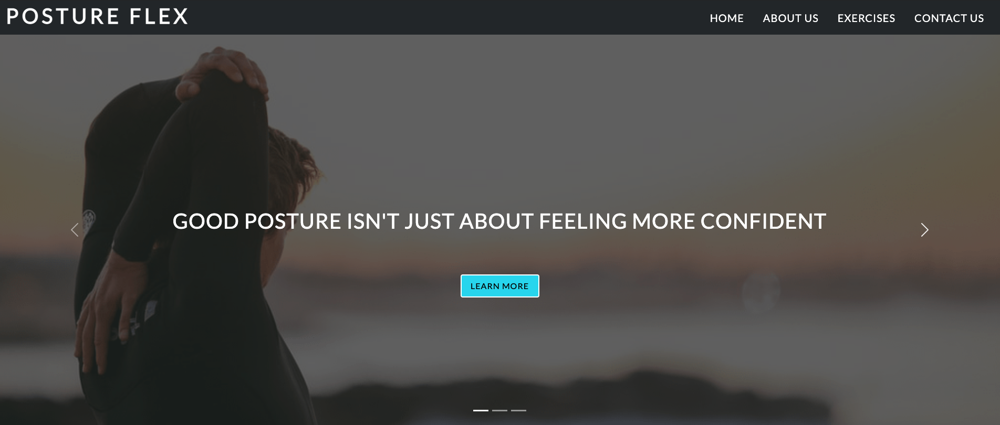

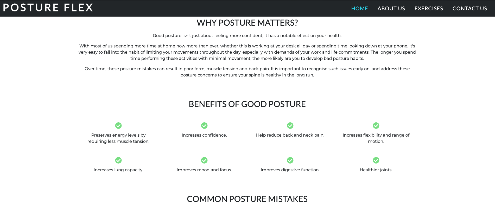

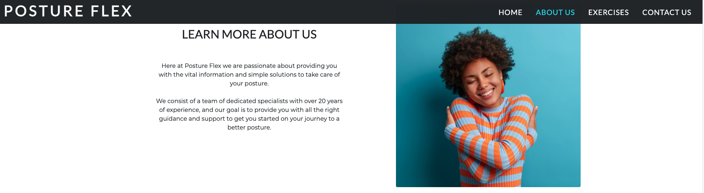

Once the user has accessed the website, at the very top the navigation gives the user to click on the 'About Us' section which will direct the user to the relevant section where they can learn more about the company, it's purpose and ethos. The user us also able to access this information by simply scrolling down the page, and the section is appropriately titled as 'Learn More About Us'. The user is also able to select the 'Home' link from the navigation bar, which will direct them to the very first section. The sections are titled appropriately such as 'Why Posture Matter?", "Benefits of Good Posture" and "Common Posture Mistakes" so this gives the user a very clear idea of what each section consists of. Alternatively, the user can also scroll down to access this section which will be the very first one the user encounters. In addition, the carousel slides at the very top of the page give a preview of the sections the user can access, for example the very first slide gives the user the option to 'Learn More' by clicking the button to be taken to the 'Home' section which gives the user a very good idea of what the website is about.

* As a __First Time Visitor__ I want to find information on the exercises available to improve my posture and how I can perform these.
* As a __Returning Visitor__ I want to continue to perform the exercises to improve my posture.
* As a __Site Owner__ I want users to be able to find the information and exercises to improve their posture in an accessible and simple way.

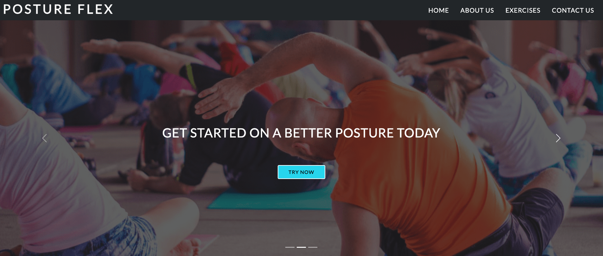

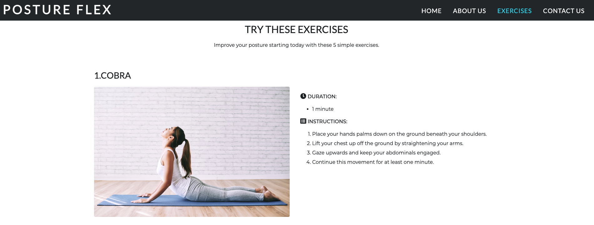

At the very top of the website, the user can select the 'Exercises' link which will direct them to the desired section, alternatively the user can select the button from the second carousel slider image or scroll down to reach this section. The section starts off with an appropriate title 'Try These Exercises' and provides a paragraph below to indicate to the user that these exercises can help improve the posture and the user is able to attempt these by themselves. Each of the exercises has a sub-heading to indicate why type of exercise this is, followed by a picture to provide visual representation to help the user visualise of what this would look like. There is also a durations and instructions sub-heading within each exercises section which provides the user the total duration of each exercise as well as the instruction on how to perform these.

* As a __First Time Visitor__ I want to navigate easily through the site and find the relevant information with ease.

The navigation at the top of the page allows the user to select the desired section within the website with ease. In addition, once the user starts to scroll down the page, the navigation is fixed at the top and will move along whilst the user scrolls down, therefore the user can always select a different section with ease and without having to scroll back up to the top. For larger screen sizes the navigation has the scrollspy component implemented, as the user scrolls down the page they can see which section they are currently at so the user can then select appropriately if they wish to direct themselves to another section without having to click again on the same section they are located on.

* As a __First Time Visitor__ I want to locate their social media accounts so I can receive updates and see their following and how well they are known and reliable.
* As a __Site Owner__ I want users to be able to locate us on social media and follow us to increase the following.

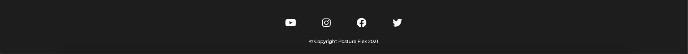

The social media links are accessed at the very bottom of the website in the footer section. These are easily identifiable by the recognisable icons used for each social media link. For the social media links the target is equal to _blank, so when the user clicks on the link this will open in a new tab instead of the current one. This provides good UX as the user does not have to navigate back to the Posture Flex website again as they can simply switch between the tabs of the website and the social media links. In addition, for users navigating with a mouse, the hover styling changes the color of the links which the user hovers over to indicate that the user can select this.

* As a __First Time Visitor__ I want to be able to contact the company with any additional questions I may have regarding the information presented.
* As a __Returning Visitor__ I want to be able to contact the company with any further questions and/or be able to provide feedback.
* As a __Site Owner__ I want users to be able to contact us with any questions or feedback of improvement regarding the content of the site.

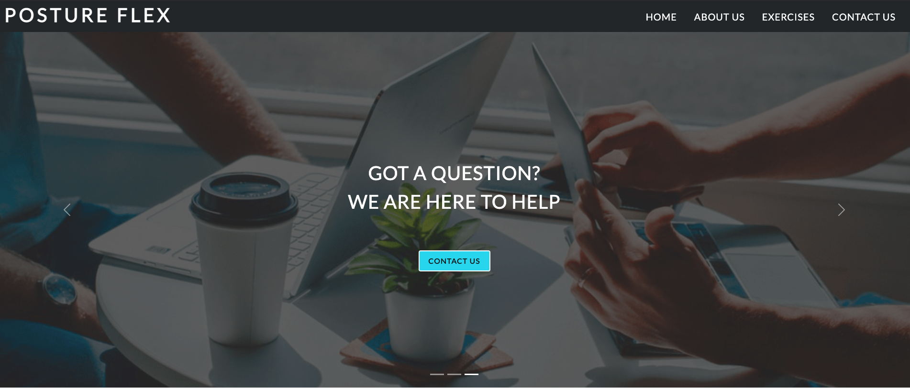

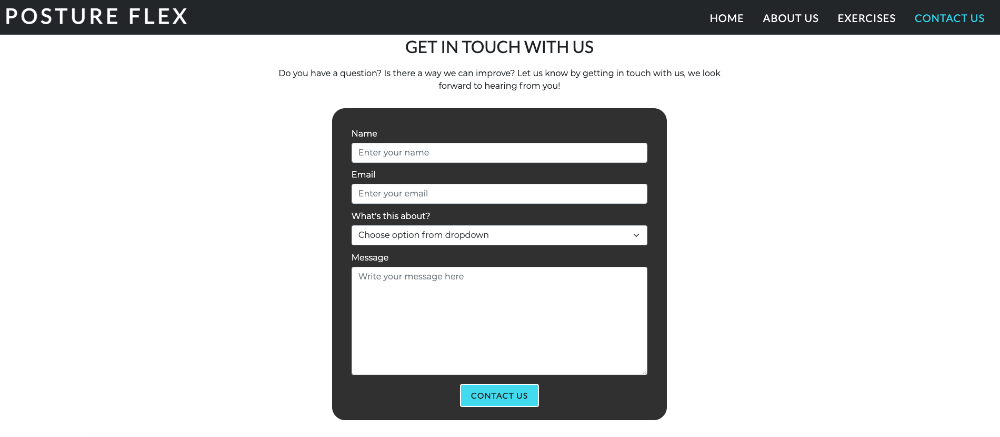

From the navigation at the top of the website the user has the option to select the 'Contact Us' link which will direct them to the relevant section. The user can also select the option to contact the company from the third carousel slider, or alternatively the user can simply scroll down the website and the section is the very last and titled appropriately as 'Get In Touch With Us'. The title is also followed by a paragraph to inform the user that this section allows them to get in contact with the company either with a question or feedback. The form itself the user has four sections to fill out for 'Name', 'Email' dropdown to select whether they want to ask a question or leave feedback and a 'Messages' section where the user can type out the details. At the bottom of the form is the submit button which allows the user to submit the details entered. The form has validation class applied, so the user is notified if any missing or incorrect information is detected. Once the user submits the form, this will open a new tab to indicate that the form has been successfully submitted, in addition this adds to the overall UX as the user is not taken away from the main website and can easily return by switching between the tabs. 

### Validation Testing 

To test the HTML code, I used the __W3C Markup Validation Service__:

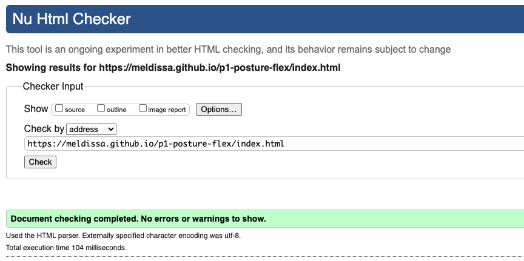

No errors were detected in the code.

To test the CSS code, I used the __W3C CSS Validation Service__:

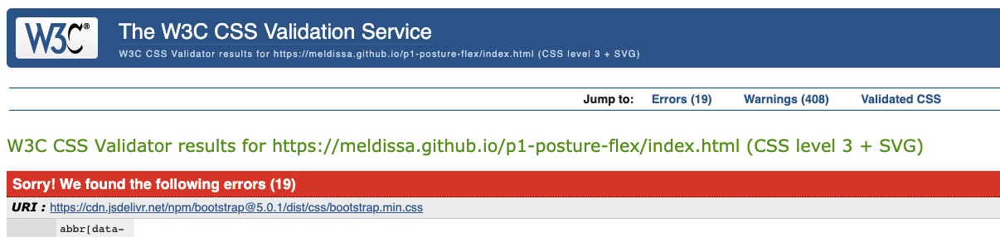

Errors were detected for the CSS code. After fixing the errors on my style.css file, I completed the CSS validation once more via direct input. This time no errors were flagged.

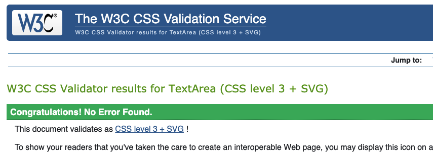

Please note that the initial CSS validation was run via the URI, which flagged up errors on both my style.css file as well as the external Bootstrap CSS file. After correcting the errors on my style.css I used direct input to complete the CSS validation which indicated my stylesheet was clear of errors.

I also used the __Chrome Dev Tools Lighthouse Report__ to test both on desktop and mobile.

For the desktop, no issues were detected, all sections were above 90:

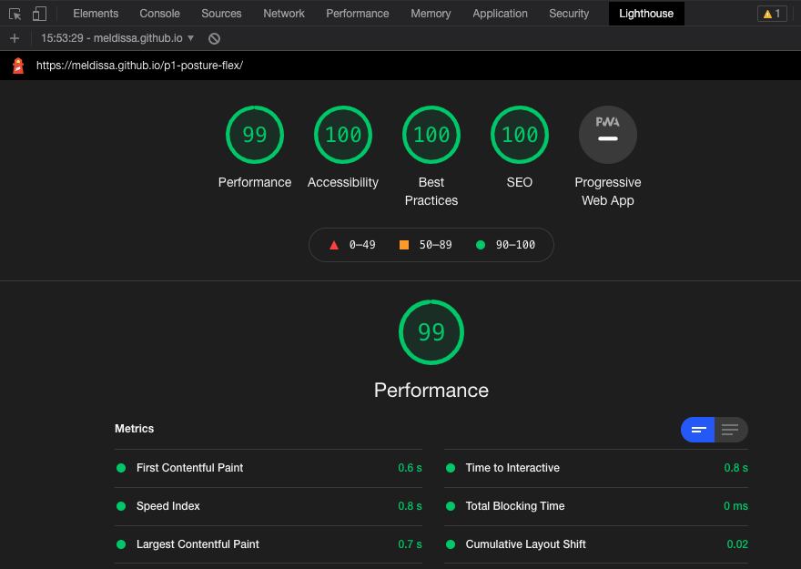

For mobile, after the initial run, issues were detected with the performance as this was only rated as 87:

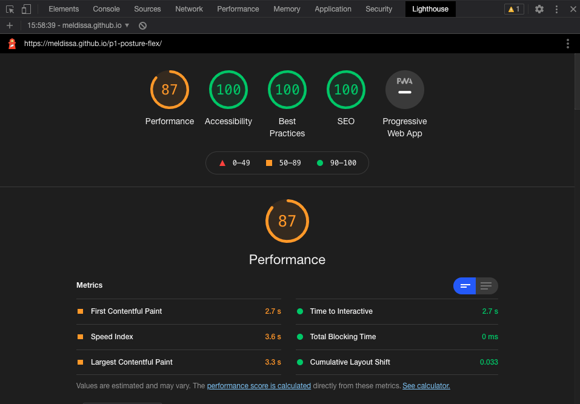

I used the guidance and suggestions provided by the report output and compressed the 3 header images used for the carousel sliders using the [Online Image Compressor](https://imagecompressor.com/) to improve the First Contentful Paint and Speed Index.

Once the compressed images were implemented, I re-produced the lighthouse report for mobile again:

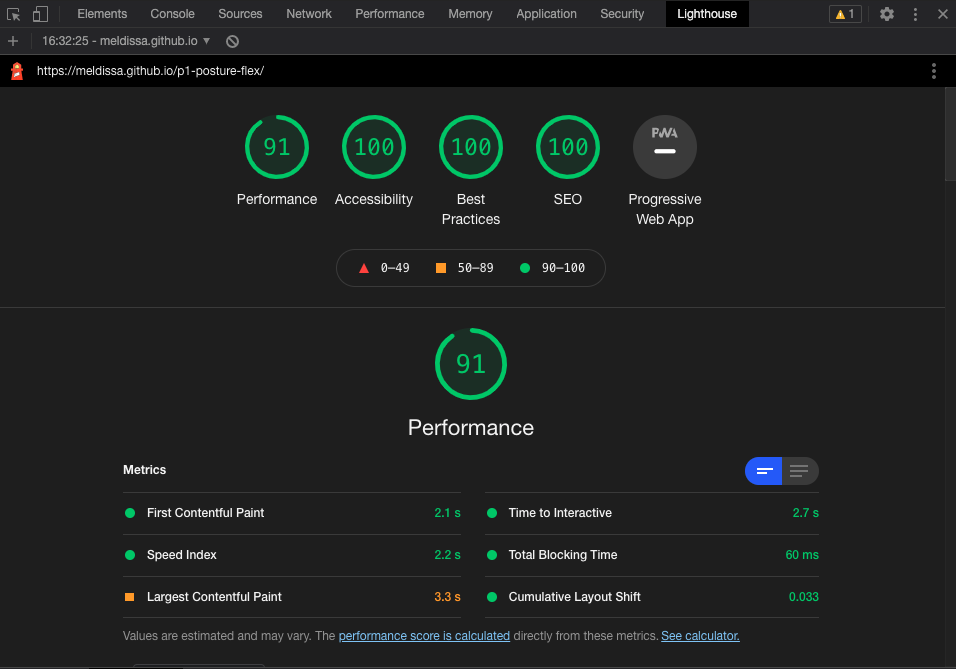

This time the performance score was 91 and in the green range.

I also tested the website color contrast using the __Color Contrast Accessibility Validatory__:

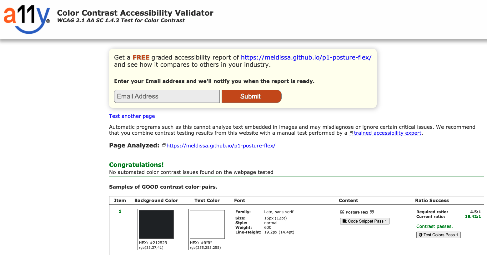

No issues were detected.

I used the __WAVE Web Accessibility Evaluation Tool__ to test the website:

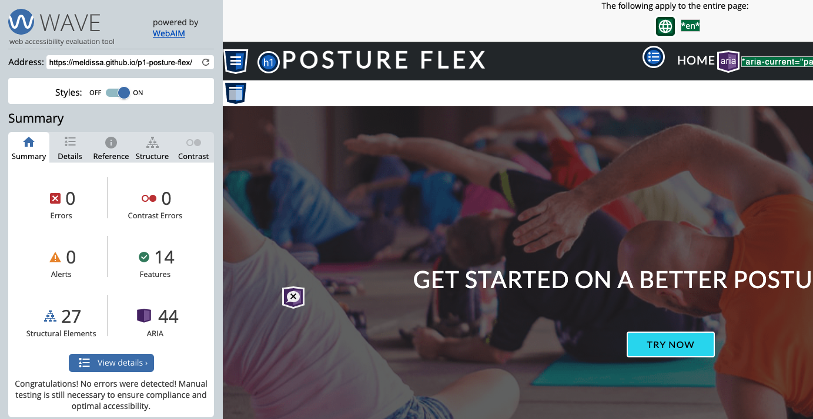

No issues were detected.

This website was tested on the following browsers:

* Google Chrome
* Safari
* Mozilla Firefox

No issues were identified using Google Chrome or Mozilla Firefox. However, an issue was identified using the Safari browser. The navigation on the Safari browser was wrapping the text for the 'Contact Us' section, which was displayed on two lines instead of one, as a result this was distorting the styling for the navigation as the text was creating additional height on the nav bar. To resolve this issue, I updated my style sheet (style.css) for the following classes: navbar-nav (white space: nowrap;), nav-item (change from margin to padding) and nav-item a (font-size changed from percentage to em). After having made these changes, the issue on the Safari browser was resolved where the navigation text was displayed all inline as expected.

This website was also tested on the following devices:

* iPhone 11 Pro
* iPhone X
* iPad Pro
* MacBook Air
* Android One Plus 8 Pro

My friends and family assisted with testing the website on multiple devices. Feedback was provided for the mobile view, to state that the collapsed navbar menu dropdown options do not disappear once the user clicks on a link to select a specific section. This is a known issue that affects the UX aspect of the website. I was able to resolve this issue with the help of my mentor, Guido Cecilio, and the [StackOverflow](https://stackoverflow.com/questions/42401606/how-to-hide-collapsible-bootstrap-navbar-on-click) post by adding JavaScript code to the project.

## Deployment 

The project was developed using GitPod and was deployed via the GitHub repository to GitHub Pages.

The following steps were followed to deploy this project:

1. Select 'Settings' from the GitHub repository:

    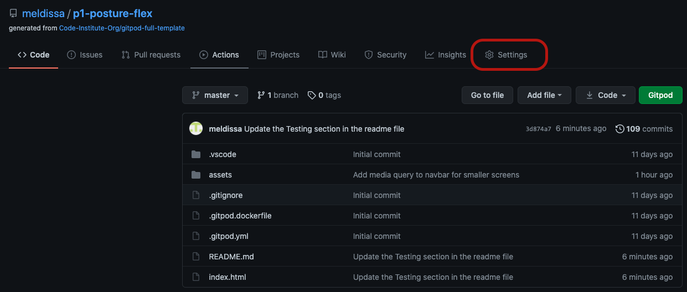

2. Select 'Pages' from the options available on the left-hand side:

    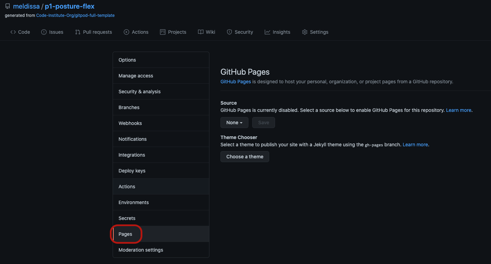

3. In the GitHub Pages section, under the 'Source', select 'master' from the dropdown:

     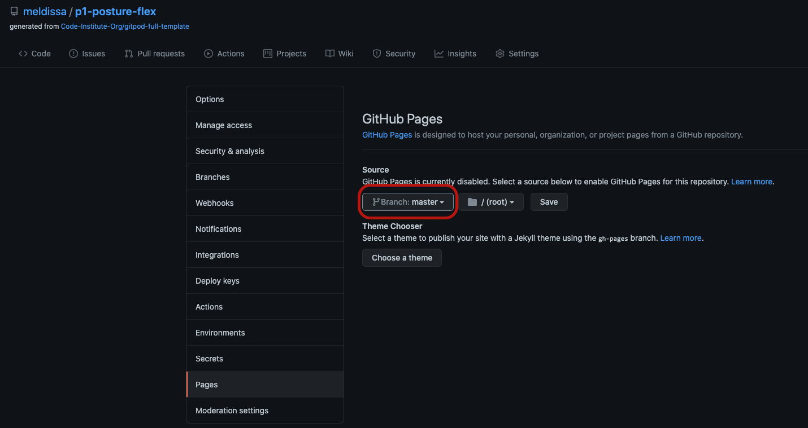

4. This will change the branch to 'master', then click 'Save' and this will generate the URL:

     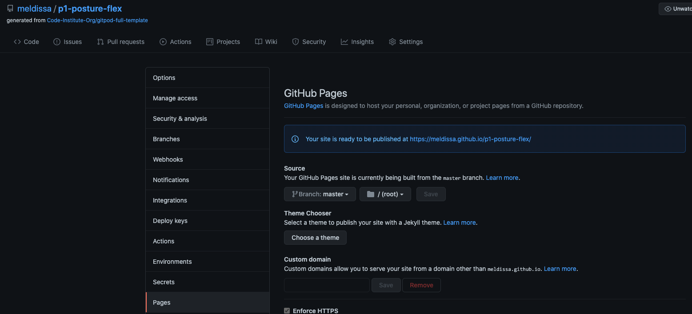

5. Refresh the page and the site is published and ready to use:

     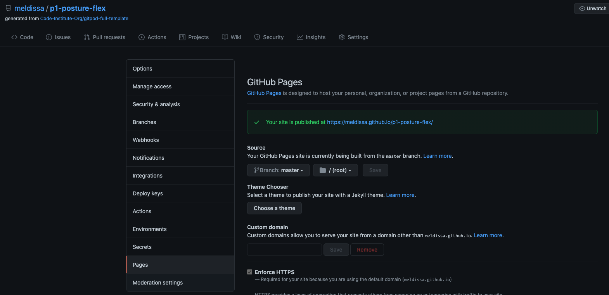

6. Click on the URL for and confirm it has been published:

     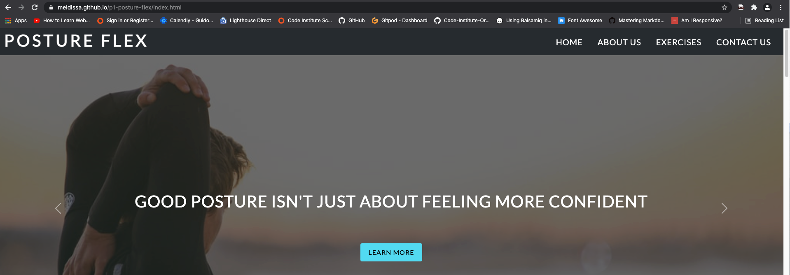

__Clone Project__:

1. Select the 'Repository' for the project from the GitHub dashboard.
2. Click on the 'Code' button.
3. From the dropdown:
    * To clone the repository using HTTPS, under "Clone with HTTPS", click the copy icon next to the link. 
    * To clone the repository using an SSH key, including a certificate issued by your organization's SSH certificate authority, click Use SSH, then click the copy icon next to the link.
    * To clone a repository using GitHub CLI, click Use GitHub CLI, then click the copy icon next to the link.
4. Open Terminal.
5. Change the current working directory to the location where you want the cloned directory.
6. Type git clone, and then paste the URL you copied earlier.
7. Press Enter to create your local clone.

__Run Project Locally__:

1. Select the 'Repository' for the project from the GitHub dashboard.
2. Click the 'Code' button, and from the dropdown select 'Download ZIP'.
3. Extract the downloaded ZIP file on your computer.
4. Open the folder with the files and proceed to open the 'index.html' file in the web browser.

## Credits 

### Content

For the Benefits of Good Posture section, the content was used from the following source:

* [Dr.BodyGadget Article](https://www.drbodygadget.com/how-to-improve-posture/)

For the Common Posture Mistakes section, the content was used from the following source:

* [NHS](https://www.nhs.uk/live-well/exercise/common-posture-mistakes-and-fixes/)

For the Exercises section, the content was used from the following sources:

* [healthshots](https://www.healthshots.com/fitness/staying-fit/try-these-5-simple-exercises-at-home-to-fix-your-bad-posture/)
* [tfliving](https://tfliving.com/2019/12/06/11-yoga-poses-to-help-correct-posture-and-alignment/)
* [classpass](https://classpass.com/movements/seated-spinal-twist#:~:text=Hook%20your%20left%20arm%20around,repeat%20on%20the%20other%20side.)
* [msn](https://www.msn.com/en-us/health/exercise/pilates/arm-and-leg-extension-on-knees/ss-BBtOhs2)

### Media

The images used for this project we obtained from the following sources:

* Carousel Slide 1 - from [Unsplash](https://images.unsplash.com/photo-1493224533326-630c89563300?ixlib=rb-1.2.1&ixid=MnwxMjA3fDB8MHxwaG90by1wYWdlfHx8fGVufDB8fHx8&auto=format&fit=crop&w=1050&q=80)
* Carousel Slide 2 - from [Unsplash](https://images.unsplash.com/photo-1549576490-b0b4831ef60a?ixlib=rb-1.2.1&ixid=MnwxMjA3fDB8MHxwaG90by1wYWdlfHx8fGVufDB8fHx8&auto=format&fit=crop&w=1050&q=80)
* Carousel Slide 3 - from [Unsplash](https://images.unsplash.com/photo-1565728744382-61accd4aa148?ixid=MnwxMjA3fDB8MHxwaG90by1wYWdlfHx8fGVufDB8fHx8&ixlib=rb-1.2.1&auto=format&fit=crop&w=1052&q=80)
* About Us - from [Freepik](https://image.freepik.com/free-photo/close-up-portrait-attractive-young-woman-isolated_273609-36522.jpg)
* Exercise 1 (Cobra) - from [Freepik](https://image.freepik.com/free-photo/yoga-girl-doing-cobra-asana-as-her-morning-exercise-home_1098-20279.jpg)
* Exercise 2 (Opposite Arm Leg Extension) - from [Freepik](https://image.freepik.com/free-photo/picture-happy-charming-young-female-with-hair-bun-doing-physical-training-light-room-performing-plank-raising-opposite-leg-arm-preparing-body-summer-people-active-lifestyle_344912-1075.jpg)
* Exercise 3 (Cat-Cow) - from [Freepik](https://image.freepik.com/free-photo/young-woman-practicing-yoga-doing-asana-paired-with-cat-pose_23-2148047405.jpg)
* Exercise 4 (Seated Twist) - from [Freepik](https://image.freepik.com/free-photo/young-woman-ardha-matsyendrasana-pose-against-city-river_1163-2402.jpg)
* Exercise 5 (Downward Dog) - from [Freepik](https://image.freepik.com/free-photo/full-length-view-flexible-young-woman-with-slim-fit-body-working-out-fitness-center-hall-doing-yoga-exercising-with-mat-wooden-floor-doing-downward-facing-dog-adho-mukha-svanasana-pose_344912-1080.jpg)

### Code

* JavaScript code for script.js for navigation menu was used from the [StackOverflow](https://stackoverflow.com/questions/42401606/how-to-hide-collapsible-bootstrap-navbar-on-click) post and my mentor, Guido Cecilio, assisted with additional amendments to the code and validation.

* [Bootstrap v5.0.1](https://getbootstrap.com/) framework was used in this project to implement certain components for the website:
    * [Navigation](https://getbootstrap.com/docs/5.0/components/navbar/): The navbar component was applied to create a a responsive navigation which changes with screen width. The basic structure was used from Bootstrap and I also added my own styling to modify this component to fit the website.
    * [Scrollspy](https://getbootstrap.com/docs/5.0/components/scrollspy/): The scrollspy component was implemented to allow the relevant section to be highlighted once the users scrolls up or down the website. The basic structure was used from Bootstrap to create this, and I also added my own styling to modify this component to fit the website.
    * [Carousel](https://getbootstrap.com/docs/5.0/components/carousel/): The carousel with captions component was implemented to create the 3 sliders at the top of the webpage which cycles through the images and provides the user with captions and buttons to select on each of these sliders. The basic structure was used from Bootstrap to create this, and I also added my own styling to modify this component to fit the website.
    * [Featurette](https://getbootstrap.com/docs/5.0/examples/carousel/#): The featurette example was used as inspiration for the 'About Us' section of the website, and the Bootstrap classes applied to get a similar effect of the layout within this section.
    * [Form](https://getbootstrap.com/docs/5.0/forms/overview/): The Bootstrap form classes were used to assist with the validation and basic style for button and input boxes. This was further styled using my own CSS stylesheet to fit the website. 
    * [Grid System](https://getbootstrap.com/docs/5.0/layout/grid/): The grid system was implemented for the overall responsiveness of the website.

## Acknowledgements 

* I would like to thank my family and friends for their support throughout this project and for assisting with the testing stage and providing valuable feedback.
* The __Slack__ Community for assisting with my queries and being overall very helpful.
* My mentor, Guido Cecilio, for being of great support and providing valuable guidance and feedback throughout this process.
